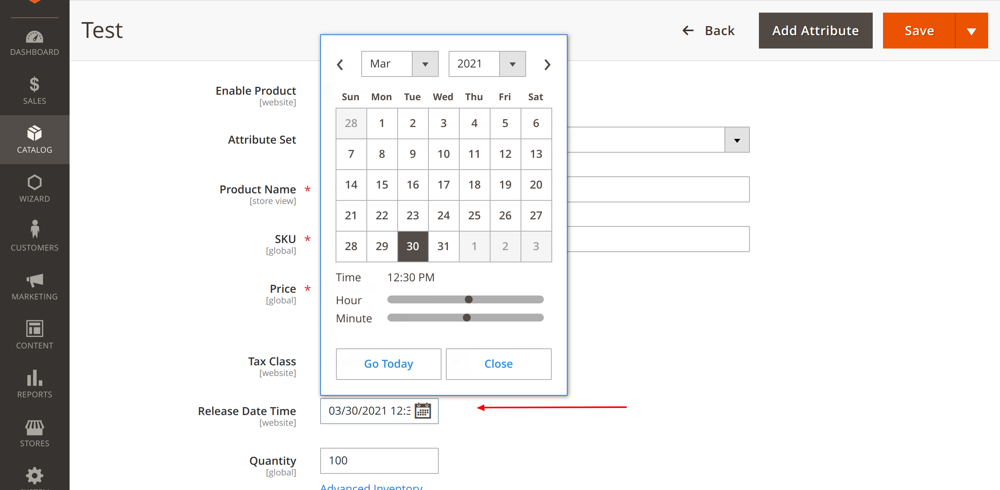

# Adapttive_Catalog

Module for Magento 2 to manage catalog release by a pre-specified date.


# Installation

- Composer:

  + Require via composer:
    ```bash
    composer require adapttive/module-catalog
    ```
  + Run Magento commands:
           
    ```bash
      bin/magento setup:upgrade
      bin/magento setup:di:compile
    ```
- Manual:

    + Extract the zip file in `magento2-root/app/code/Adapttive/Catalog`
    + Run Magento commands:
         
         ```bash
            bin/magento setup:upgrade
            bin/magento setup:di:compile
         ```
      
# Usage

- Update the `Release Date Time` attribute values in product edit form in the admin:

    
    
- Add the product in the cart will throw an error message:

     
       
- Attribute display on product page:

    
   
# Technical

- `ReleaseValidator` is the common class to validate release date of product `\Adapttive\Catalog\Model\ReleaseValidator::validate`
- `ReleaseObserver` is the validation trigger point for all cart requests `\Adapttive\Catalog\Observer\ReleaseObserver::execute`
